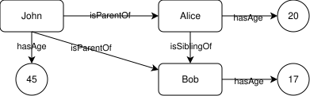
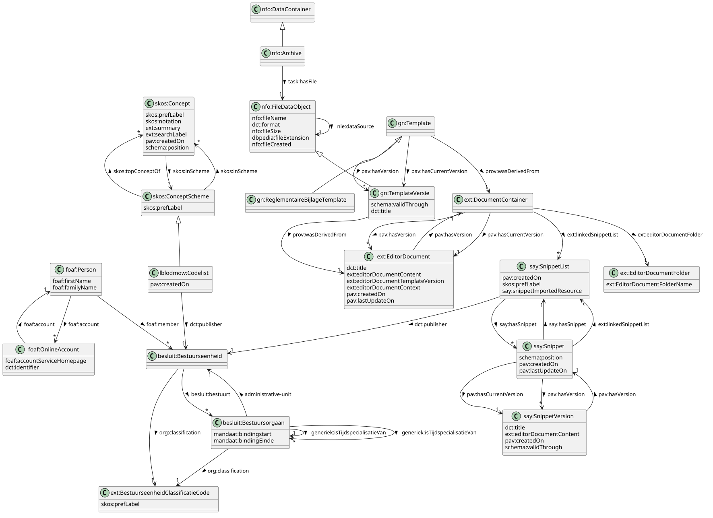

# Fetching templates from the SPARQL Endpoint


## SPARQL and Linked Data Crash Course
SPARQL is a query language (such as SQL) used to retrieve data from Linked Data databases. In Linked Data, data is stored as a set of statements of the form `subject predicate object`, for example `<John> <hasAge> 45`. A set of these statements can form a database, also called a graph or triplestore. For example:
```ttl
<John> <hasAge> 45 .
<John> <isParentOf> <Alice> .
<Alice> <hasAge> 20 .
<Alice> <isSiblingOf> <Bob> .
<Bob> <hasAge> 17 .
```

In order to represent such a database using a human-readable format there exist different formats. The example above uses the [turtle](https://en.wikipedia.org/wiki/Turtle_(syntax)) file format. Some others include [JSON-LD](https://json-ld.org/) and [RDF-XML](https://www.w3.org/TR/rdf-syntax-grammar/).

Notice that we can put `<Alice>` both as *subject* and as *object*, this is one of the core features of Linked Data that allows us to link different so-called *resources* (such as `<Alice>`, `<John>` and `<Bob>`) toghether using well-defined and meaningful predicates. Because of these links between resources we can view this database as a directed graph where the nodes are the resources and the predicates are the links. Visualized this becomes:




### URI's and Prefixes
In the example above we used `<John>`, `<Alice>` and `<Bob>` as identifiers for our resources. This might be enough in very small databases but if we want to link our data to other databases this might cause problems if they also have another resource with the same `<John>` identifier. For this reason Linked Data makes use of [IRI's (Internationalized Resource Identifiers)](https://nl.wikipedia.org/wiki/Uniform_resource_identifier) (also called URI)$^{*}$ which can look as follows `<http://johns-family.org/people/cc45927fd06f>`. This still represents John but in a way that should be unique across different data sources. Sometimes a IRI can also be used to look up more information about a resource if it happens to be a URL, but this is not required. It is important to note that also predicates are defined using a IRI, this is one of Linked Data's core features that makes it so that a predicate has a well-defined unique meaning across different databases and allows us to link databases together trivially.

*\*: Although not exactly the same, the terms IRI and URI are often used interchangeably, with URI being more prominent in most applications. This document will refer to IRI's as URI's from now on*

If we now write the previous database using URI's we get the following:
```ttl
<http://johns-family.org/people/365528a6b3e0> <http://xmlns.com/foaf/0.1/age> 45 .
<http://johns-family.org/people/365528a6b3e0> <http://purl.org/vocab/relationship/parentOf> <http://johns-family.org/people/8c794aeafa2b> .
<http://johns-family.org/people/8c794aeafa2b> <http://xmlns.com/foaf/0.1/age> 20 .
<http://johns-family.org/people/8c794aeafa2b> <http://purl.org/vocab/relationship/siblingOf> <http://johns-family.org/people/93a00446e526> .
<http://johns-family.org/people/93a00446e526> <http://xmlns.com/foaf/0.1/age> 17 .
<http://johns-family.org/people/365528a6b3e0> <http://xmlns.com/foaf/0.1/givenName> "John" .
<http://johns-family.org/people/8c794aeafa2b> <http://xmlns.com/foaf/0.1/givenName> "Alice" .
<http://johns-family.org/people/93a00446e526> <http://xmlns.com/foaf/0.1/givenName> "Bob" .
```
Note that we added the `foaf:givenName` predicate because we cannot derive the names from the resource identifier anymore.

Because a URI can become verbose, many tools and formats that interact with Linked Data support a mechanism of shortening the URI's: *prefixes*. If we define the prefix `people` to be `http://johns-family.org/people/`, we can rewrite the previous URI as `people:cc45927fd06f` (notice the absence of angle brackets as opposed to the verbose form).

A real-world example of our example using Turtle would thus be:
```ttl
PREFIX people: <http://johns-family.org/people/>
PREFIX foaf: <http://xmlns.com/foaf/0.1/>
PREFIX relationship: <http://purl.org/vocab/relationship/>

people:365528a6b3e0 foaf:age 45 .
people:365528a6b3e0 relationship:parentOf people:8c794aeafa2b .
people:8c794aeafa2b foaf:age 20 .
people:8c794aeafa2b relationship:siblingOf people:93a00446e526 .
people:93a00446e526 foaf:age 17 .

people:365528a6b3e0 foaf:givenName "John" .
people:8c794aeafa2b foaf:givenName "Alice" .
people:93a00446e526 foaf:givenName "Bob" .
```

### Classes
A very common mechanism in Linked Data is to assign one or more classes to resources. This is formally described in the [RDFS](https://www.w3.org/TR/rdf-schema/) specification. In practice this means that some resources represent "a class" and are attached to other resources using the `<http://www.w3.org/1999/02/22-rdf-syntax-ns#type>` (or using the short-hand form `rdf:type`) predicate. In many languages and tools (such as SPARQL and Turtle used here) this predicate can be shortened to `a` (as in natural english "John is **a** person"). In the Turtle format this would be `people:365528a6b3e0 a foaf:Person` which is equivalent to `people:365528a6b3e0 rdf:type foaf:Person`.

### SPARQL
Now that we know how Linked Data is structured, let's look at how to retrieve specific information from such a database. This is done using the SPARQL query language. A SPARQL `SELECT` query might look as follows: 
```sparql
PREFIX people: <http://johns-family.org/people/>
PREFIX relationship: <http://purl.org/vocab/relationship/>

SELECT ?person WHERE {
  ?person relationship:parentOf people:93a00446e526 .
}
```
And when executed on our example database will result in a table with a single row:
| ?person    |
| -------- |
|  `<http://johns-family.org/people/365528a6b3e0>` |


We see the query above has two parts: a `SELECT` clause which lists the variables (in this case `?person`) to appear in the results and a `WHERE` clause which provides a pattern to match against the database. Here we are looking for all resources which appear as the subject of a triple with the predicate `relationship:parentOf` and object `people:93a00446e526`.
SPARQL allows us to defined as many variables as we want, if we wanted to list all John's children together with their age we could run:
```sparql
PREFIX people: <http://johns-family.org/people/>
PREFIX foaf: <http://xmlns.com/foaf/0.1/>
PREFIX relationship: <http://purl.org/vocab/relationship/>

SELECT ?child ?name ?age WHERE {
  people:365528a6b3e0 relationship:parentOf ?child .
  ?child foaf:givenName ?name .
  ?child foaf:age ?age . 
}
```
Which results in:
| ?child   | ?name | ?age |
| -------- | ------- | ----- |
| `<http://johns-family.org/people/8c794aeafa2b>` | "Alice"  | 20    |
| `<http://johns-family.org/people/93a00446e526>` | "Bob" | 17     |

In this case we used three variables: `?child`, `?name` and `?age`. The results list all assignments of those variables that satisfy all patterns given in the query.

In addition to triple patterns, SPARQL also provides other mechanisms to filter the data based on your needs. The `FILTER` keyword allows to filter based on certain conditions. `ORDER BY` allows ranking the results and `LIMIT` limits the results to a given amount.
Some examples:
```sparql
PREFIX people: <http://johns-family.org/people/>
PREFIX foaf: <http://xmlns.com/foaf/0.1/>
PREFIX relationship: <http://purl.org/vocab/relationship/>

SELECT ?child ?name ?age WHERE {
  people:365528a6b3e0 relationship:parentOf ?child .
  ?child foaf:givenName ?name .
  ?child foaf:age ?age . 
  FILTER (?age < 18)
}
```
| ?child   | ?name | ?age |
| -------- | ------- | ----- |
| `<http://johns-family.org/people/93a00446e526>` | "Bob" | 17     |
```sparql
PREFIX people: <http://johns-family.org/people/>
PREFIX foaf: <http://xmlns.com/foaf/0.1/>
PREFIX relationship: <http://purl.org/vocab/relationship/>

SELECT ?child ?name ?age WHERE {
  people:365528a6b3e0 relationship:parentOf ?child .
  ?child foaf:givenName ?name .
  ?child foaf:age ?age . 
} 
ORDER BY DESC(?age) 
LIMIT 1
```
| ?child   | ?name | ?age |
| -------- | ------- | ----- |
| `<http://johns-family.org/people/8c794aeafa2b>` | "Alice"  | 20    |
Note that also a predicate can be a variable, this is a powerful feature of SPARQL and allows us to explore a database even if we don't know anything about its structure. If we want to know all predicates we have available about resources in the database we could run.
```sparql
SELECT DISTINCT ?predicate WHERE {
  ?subject ?predicate ?object .
} 
```
| ?predicate   | 
| -------- |
| `<http://xmlns.com/foaf/0.1/age>` |
| `<http://purl.org/vocab/relationship/parentOf>` |
| `<http://xmlns.com/foaf/0.1/givenName>` |
| `<http://purl.org/vocab/relationship/siblingOf>` |

Note `DISTINCT` after `SELECT` prevents the same row appearing multiple times in the results.

The [full SPARQL spec](https://www.w3.org/TR/sparql11-query/) is very readable and is recommended reference material.
 
## SPARQL queries for Regulatory Statements
Now will look at some common queries related to the Regulatory Statements (RB). The datamodel for RB is decribed by the UML diagram below:



### Fetching templates by type (Decision or Regulatory Attachment)
In order to differentiate between the two template types, we make use of folders (`ext:EditorDocumentFolder`). Each type has its own folder, summarized below:
| Document Type   | Folder ID (`mu:uuid`) |
| -------- | ------- |
| Decision | 8460981D-CB21-4710-B7B5-9DD2DFD11888 |
| Regulatory Attachment | 7A4CA4A9-D7A4-4A99-B2FB-39B6D535FC1D |

So in order to fetch all decision templates we execute the following query:
```sparql
PREFIX gn: <http://data.lblod.info/vocabularies/gelinktnotuleren/>
PREFIX prov: <http://www.w3.org/ns/prov#>
PREFIX mu: <http://mu.semte.ch/vocabularies/core/>
PREFIX ext: <http://mu.semte.ch/vocabularies/ext/>

SELECT DISTINCT ?template WHERE {
  VALUES ?folderId {
    """8460981D-CB21-4710-B7B5-9DD2DFD11888""" # Decision
  }

  ?template a gn:Template .
  ?template prov:wasDerivedFrom ?container .
  ?container ext:editorDocumentFolder ?folder .
  ?folder mu:uuid ?folderId .
} 
```
Note the SPARQL `VALUES` directive determines the template type here (more about the `VALUES` directive [here](https://www.w3.org/TR/sparql11-query/#inline-data)).

This results in a list of template URI's, which is not useful on its own but we can build upon this query to get more detailed information. For example, if we want to get the `dct:title` and `ext:editorDocumentContent` of the latest version of each decision template we run:
```sparql
PREFIX gn: <http://data.lblod.info/vocabularies/gelinktnotuleren/>
PREFIX pav: <http://purl.org/pav/>
PREFIX prov: <http://www.w3.org/ns/prov#>
PREFIX task: <http://redpencil.data.gift/vocabularies/tasks/>
PREFIX nie: <http://www.semanticdesktop.org/ontologies/2007/01/19/nie#>
PREFIX mu: <http://mu.semte.ch/vocabularies/core/>
PREFIX ext: <http://mu.semte.ch/vocabularies/ext/>
PREFIX dct: <http://purl.org/dc/terms/>

SELECT DISTINCT ?title ?htmlContent WHERE {
  VALUES ?folderId {
    """8460981D-CB21-4710-B7B5-9DD2DFD11888""" # Decision
  }

  ?template a gn:Template .
  ?template prov:wasDerivedFrom ?container .
  ?container ext:editorDocumentFolder ?folder .
  ?folder mu:uuid ?folderId .

  ?template pav:hasCurrentVersion ?version .
  ?version prov:wasDerivedFrom ?editorDoc .
  ?editorDoc dct:title ?title .
  ?editorDoc ext:editorDocumentContent ?htmlContent .
}
```